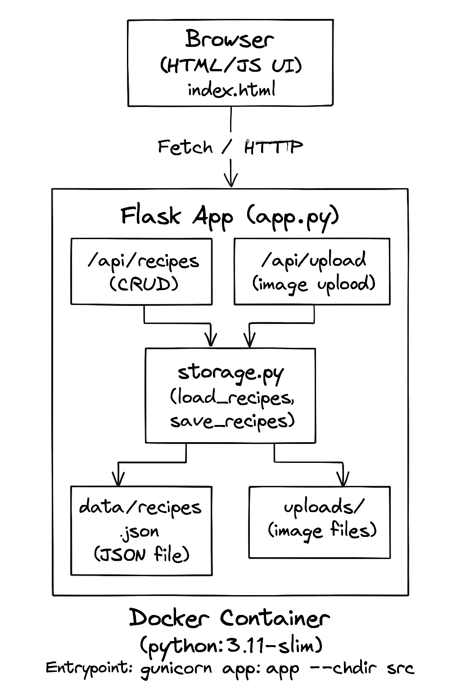
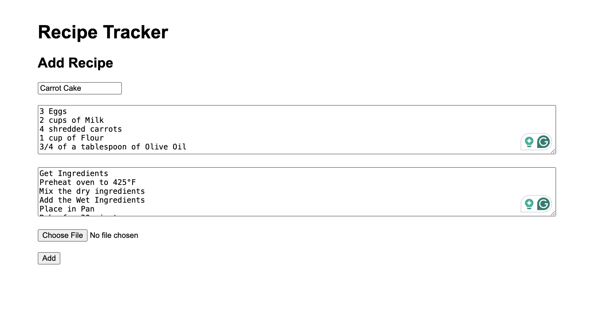
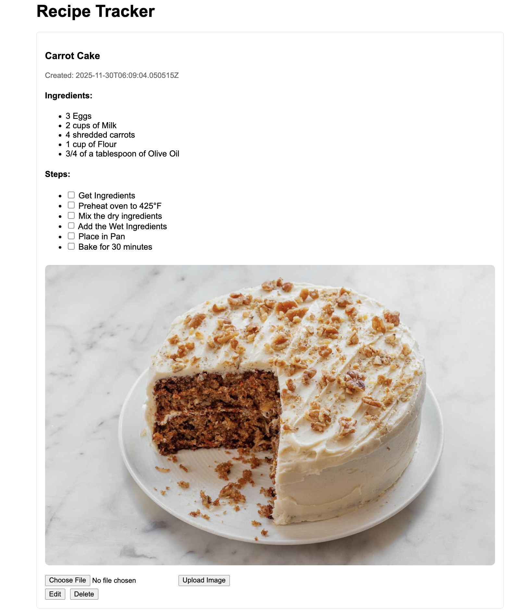
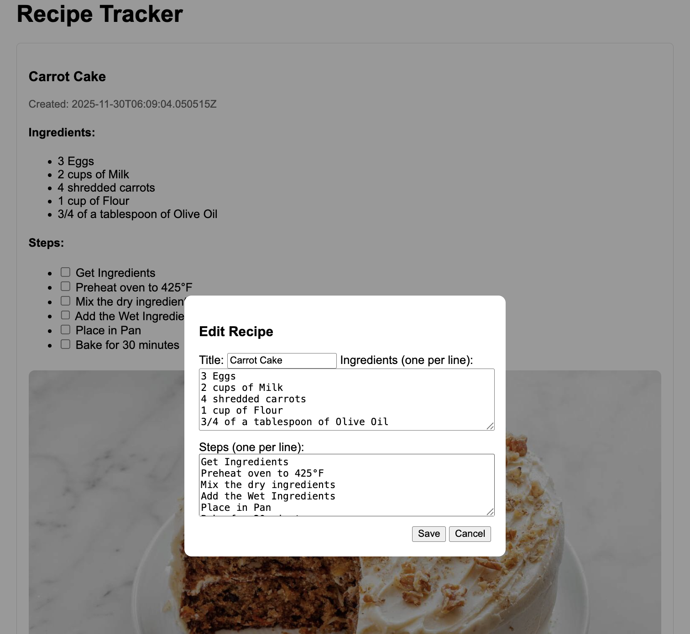

# Recipe Tracker

Recipe Tracker — Final Project
1) Executive Summary

Problem:
Most recipe apps are cluttered, require accounts, or don’t let users change steps after adding a recipe. When cooking, mistakes happen, steps need editing, ingredients change, and users want to add photos of their own results. I wanted a simple tool that works locally, requires no login, and keeps recipes organized.

Solution:
I built a Flask-based Recipe Tracker that lets users create recipes, edit them, upload images, check off steps while cooking, and delete recipes. The project includes a REST API, local JSON storage, image upload handling, and a clean web UI. Everything runs  inside Docker with a single command.

2) System Overview
Course Concept(s) Used

This project integrates several module concepts:

1.Flask REST API
Used for recipe CRUD operations, image upload routes, and the health endpoint.

2.Data Pipeline / Local Storage Schema
Recipes are stored in structured JSON under /data/recipes.json and safely loaded/saved with helper functions.

3.File Upload Pipeline
Images are validated, sanitized, timestamped, saved to /uploads, and served via Flask.

4.Containerization (Docker)
Full environment packaged for reproducible execution with one command.

5.Basic Logging
All key events (create/update/delete/upload) are logged to stdout for observability.

Architecture Diagram


Data, Models, Services

| Component    | Format                          | Purpose                                                 |
| ------------ | ------------------------------- | ------------------------------------------------------- |
| Recipes      | JSON file (`data/recipes.json`) | Stores title, ingredients, steps, image URL, timestamps |
| Images       | PNG/JPG in `/uploads`           | Uploaded user photos                                    |
| Frontend     | HTML/CSS/JS                     | Renders recipes & handles editing                       |
| Backend      | Flask API                       | Serves UI, handles CRUD & uploads                       |
| Dependencies | requirements.txt                | Flask, Gunicorn, Pytest                                 |

3) How to Run (Local via Docker)

One-command build & run:

./run.sh

This script:
1. Builds the Docker image
2. Runs the container
3. Mounts local data/ and uploads/ so recipes persist

Then open in your browser: http://localhost:5000

Health Check: curl http://localhost:5000/api/health

4) Design Decisions

Why Flask?
- Lightweight and perfect for small REST APIs
- Easy to integrate with templates and static files
- Matches course modules 
- Simple

Why this Docker Base Image (python:3.11-slim)?

I used the official python:3.11-slim image because it is a lightweight, secure, and fast base for Python applications.
The “slim” tag removes unnecessary OS libraries, reducing the image from nearly 1 GB (full Python) to around ~120 MB.

Why JSON for storage?
- Easy to read, debug, and version
- Simple and stable for single-user use
- No external database required
- Works well with mounted Docker volumes

Alternatives considered:
- SQLite → good but overkill
- localStorage → no file uploads

| Choice                | Benefit             | Tradeoff                       |
| --------------------- | ------------------- | ------------------------------ |
| JSON storage          | Simple, transparent | Not scalable for multi-user    |
| Timestamped filenames | No collisions       | Long names                     |
| No authentication     | Faster UX           | Not safe for public deployment |
| Local image storage   | Full control        | No CDN/caching                 |

Security, Ethics, and Ops
- No user data collected (no logins)
- Filenames sanitized to avoid path traversal
- Only image types allowed for upload (PNG/JPG/GIF)
- Secrets not included in repo
- Intended for local only; public hosting would require Auth
- Logging supports debugging via stdout
- Health endpoint (/api/health) allows monitoring

5) Results & Evaluation
Features Implemented:
- Add recipes
- Upload images when creating a recipe
- Upload/replace images after creation
- Edit recipes (title, ingredients, steps)
- Check off steps (state persists)
- Delete recipes
- Fully functional JSON storage
- Logging for create/update/delete/upload
- Dockerized with reproducible run

Screenshots




Testing / Validation

Tests written using pytest and Flask’s test_client().

Run tests with: 
```bash
pytest -q
```
Example test:
```bash
def test_health():

    client = app.test_client()
    r = client.get("/api/health")
    assert r.status_code == 200
    assert r.get_json()["status"] == "ok"
```
All current tests pass.

6) What’s Next
- Add categories (Breakfast, Dinner, Dessert)
- Search bar for recipe titles
- Drag-and-drop step reordering
- Dark mode/light mode
- Public “view only” recipe page
- Move storage to SQLite for multi-user support

7) Links

GitHub Repository:
https://github.com/AimeeLuna21/Recipe-Tracker.git

Public Deployment (optional):
Not deployed

## Quickstart (local)
1. python3 -m venv .venv
2. source .venv/bin/activate
3. pip install -r requirements.txt
4. python src/app.py
Open http://127.0.0.1:5000

